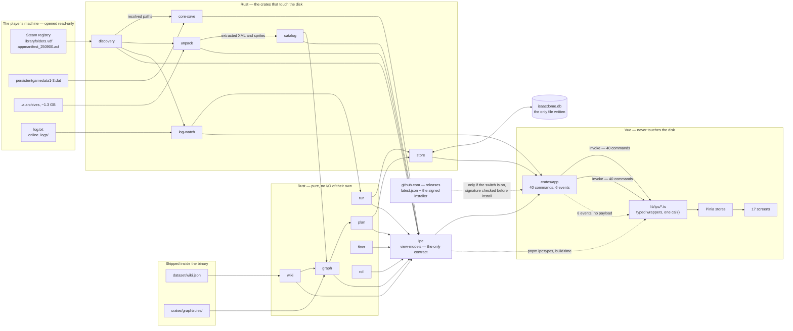
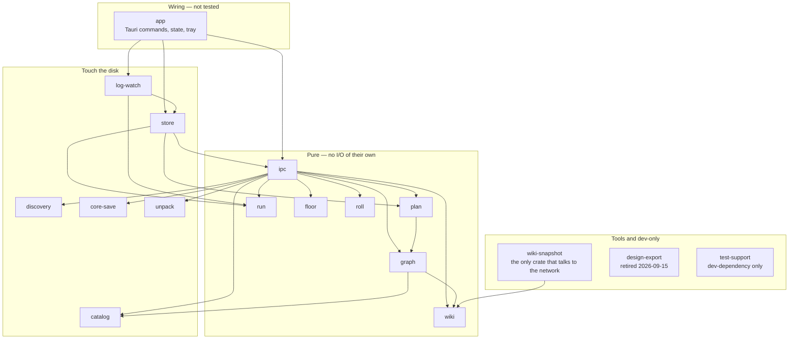
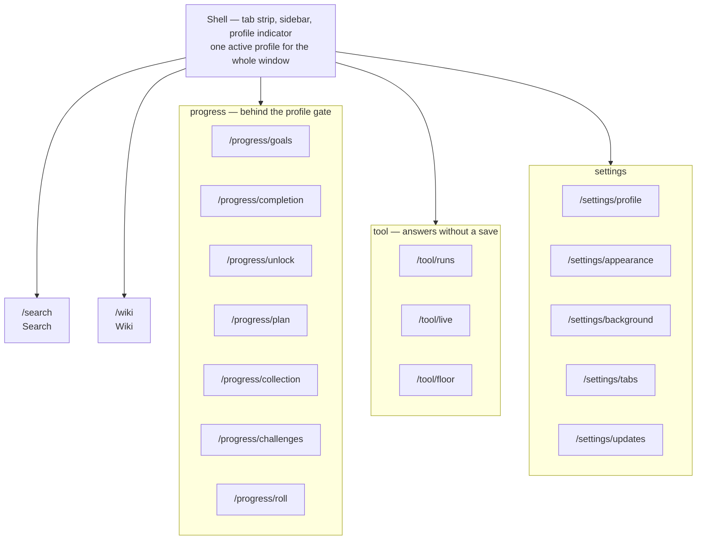
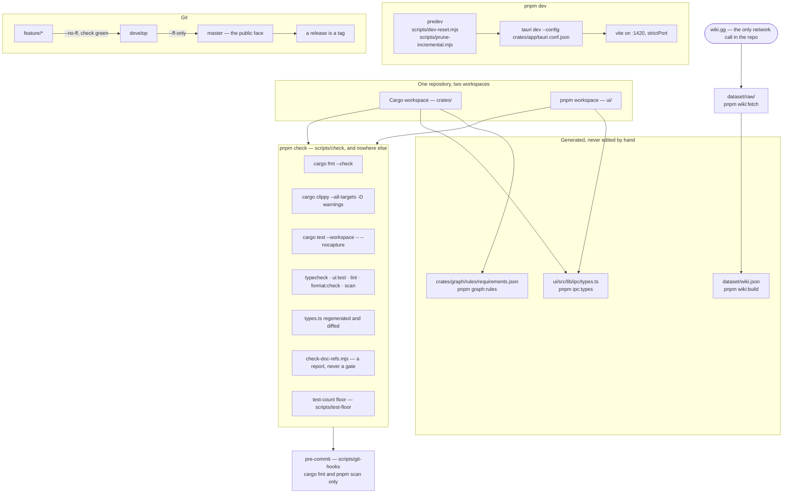

# Architecture

Four diagrams, one question each: what the program does with the files it finds, which crates
that takes, what the screens are, and what it takes to build and check the thing.

> **This is the state, not the design.** `docs/PROJECT.md` is the design and freezes at M0 by
> its own header — it says so in its first paragraph — so a diagram of *today* could not live
> there without breaking that promise. Drawn on 2026-09-18 against `20f04a5`; redrawn on
> 2026-09-20 on `feature/app-update`, which added the seventeenth route, four commands, the
> sixth event and the one arrow that leaves the machine.
>
> **What keeps it true, and what does not.** Every path named here is checked by
> `scripts/check-doc-refs.mjs`, which is why the nodes carry real paths instead of pretty
> names. That catches a file renamed under the document and *nothing else*: an edge that
> stopped existing leaves its arrow drawn, and only a person ever notices.
>
> **Redraw it in the same commit as the change**, and `CLAUDE.md` names the five that trigger
> it: a crate added or removed, a route added or removed from `RouteName`, a command joining or
> leaving `generate_handler!` in `crates/app/src/lib.rs`, an event in
> `crates/app/src/events.rs`, a migration in `crates/store/src/migrations.rs`. The five counts
> just below are the tripwire — if one of them is wrong, so is the drawing.

Counted at that commit, and every number below is derived from the code, not from prose:
**17 crates**, **40 Tauri commands**, **6 events**, **17 routes**, **6 store migrations**.

---

## 1 — How the program works

From the files on a stranger's disk to the pixels, in one picture.

**The dotted arrow from `github.com` is the only one that leaves the machine**, and it is the
only one anybody can switch off. It carries the app's own update: a manifest, then a signed
installer whose signature is checked before a byte of it is run. With "aggiorna automaticamente"
off, no request is made at all — not a quiet one. `docs/release.md` is the whole of what happens
on the other end of it.

**Everything that opens a file sits to the left of `ipc`.** That is the project's oldest rule
made visible: the frontend has no path, no offset and no log string to get wrong, because none
ever reaches it. `floor` is the one crate with no arrow coming in from the disk — its input is
the grid the user paints, which arrives from the right.

**One node is a cylinder, and that is the point.** `isaacdome.db` is the only file the app
writes. The `.dat` has an arrow in and none out, by construction: there is no write function in
`core-save` to draw one from.

**The frontend has one door, and it is not `invoke`.** Screens read Pinia stores, stores call
the typed wrappers in `ui/src/lib/ipc/`, and every wrapper goes through the single `call()` in
`transport.ts` — which answers from fixtures in a plain browser and from `invoke` inside Tauri.
`SearchScreen.vue` is today the only screen that reaches a wrapper directly; every other one
stops at a store. `pnpm scan` is what keeps a component from taking the shortcut.

**Pull, then a nudge.** The 40 commands are pull: a window asks, the backend answers. The 6
events (`profile-changed`, `settings-changed`, `plan-changed`, `runs-changed`, `roll-changed`,
`update-changed`) are the nudge, and they carry **no payload** on purpose — a payload would be a copy of state the
next command could contradict. A second window only ever learns of a write it did not make this
way.

---

## 2 — The crates

Runtime dependencies only. Dev-dependencies are left out: nine crates depend on `test-support`,
and drawing that would say nothing except that the tests run on real data.

**"Pure" means no I/O of its own, not no dependency on I/O.** `ipc` is pure and depends on
`discovery`, `core-save` and `unpack`: it reads their *types* and shapes them, it opens nothing.
That distinction is what lets `ipc` be a crate whose return values are all worth checking.

**`app` depends on twelve crates, and only three edges are drawn.** `ipc`, `store` and
`log-watch` are the ones it orchestrates; the other nine — `roll` among them, since 3.12 — it
names to pass their types through. The full list is `crates/app/Cargo.toml`, and it is the one
place where reading the manifest beats reading a diagram.

**`store` depends on `ipc`, which is the edge worth pausing on** — persistence pointing at the
boundary crate, not the other way round. The plan queue is stored as one JSON document of the
same view-models the frontend receives, so the shape has exactly one definition. `ipc` does not
depend on `store` in return: nothing in the contract knows there is a database.

**Eight crates depend on nothing of ours**: `discovery`, `core-save`, `unpack`, `catalog`,
`run`, `wiki`, `floor`, `roll`. Each is a leaf that can be read, tested and replaced on its
own — which is the whole reason a patch to the game's format is a patch here and not a
rewrite.

---

## 3 — The screens

The shell behaves like a browser: several tabs at once, and a tab is a **location** — a screen,
a wiki page, an item — that saves its identity and never its content.

The grouping is not decoration: `routes.ts` derives `needsProfile` from the origin being
`progress`, so the seven screens in that box are exactly the ones the gate covers. The three
tools answer from the log, the archive and the user's own drawing, which is why they sit
outside it.

| Screen | Path | Origin | Reads through | Commands behind it |
|---|---|---|---|---|
| Search | `/search` | search | `lib/ipc/search` directly, `tabs` | `search` |
| Goals | `/progress/goals` | progress | `views`, `queue`, `tabs` | `graph_views`, `want`, `plan`, `add_goal`, `remove_goal`, the five `queue_*` |
| Completion | `/progress/completion` | progress | `views` | `save_summary`, `completion` |
| Unlock | `/progress/unlock` | progress | `views`, `queue` | `graph_views`, `want`, the five `queue_*` |
| Plan | `/progress/plan` | progress | `views`, `queue` | `plan`, `add_goal`, `remove_goal`, the five `queue_*` |
| Collection | `/progress/collection` | progress | `views` | `collection` |
| Challenges | `/progress/challenges` | progress | `views`, `queue`, `tabs` | `challenges`, the five `queue_*` |
| Roll | `/progress/roll` | progress | `roll` | `roll`, `roll_draw`, `set_roll_preset` |
| Runs | `/tool/runs` | tool | `views` | `runs` |
| Live | `/tool/live` | tool | `views` | `live` |
| Floor | `/tool/floor` | tool | `floor` | `floor_candidates` |
| Wiki | `/wiki` | wiki | `wiki` | `wiki_entry`, `wiki_index` |
| Profile | `/settings/profile` | settings | `profile` | `setup_state`, `select_profile`, `save_summary`, `completion` |
| Appearance | `/settings/appearance` | settings | `settings` | the six below |
| Background | `/settings/background` | settings | `settings` | the six below |
| Tabs | `/settings/tabs` | settings | `settings` | the seven below |
| Updates | `/settings/updates` | settings | `update`, `settings` | `update_status`, `check_update`, `install_update`, `set_auto_update` |

The `settings` store is shared by its four screens and holds all seven between them: `settings`,
`set_scale`, `set_stay_in_background`, `set_resume_tabs`, `set_auto_update`, `autostart`,
`set_autostart`. A column splitting those per screen would be a guess, and the store is the
honest granularity. Updates is the one settings screen with a store of its own beside it,
because the phase it draws is held in the backend and changes without anybody asking.

**Thirty-five of the forty commands are reachable from a screen.** The other five are not
loose ends: `window_session` and `set_window_session` belong to the shell and travel through
`ui/src/lib/window/session.ts`; `extraction_report` is called only by the development-only
verification page, `ui/src/verify/VerifyPage.vue`; and `choose_game_folder` and
`choose_saves_folder` belong to the welcome flow that runs before any screen is routed,
`ui/src/screens/welcome/NothingFound.vue`. 35 + 2 + 1 + 2 = 40, which is the kind of sum worth
recomputing whenever this table is edited — it was wrong before this branch too, the two
`choose_*` commands were never in it.

---

## 4 — The infrastructure

Two workspaces in one repository, no CI, and a single script that holds the list of checks.

**There is no CI, by decision.** The consequence is that `scripts/check` is not *a* list of the
checks, it is *the* list: the README, the pre-commit hook and `CLAUDE.md` all point at that file
instead of repeating it, so they cannot drift apart. The hook deliberately runs only the two
fast ones — a slow hook is a bypassed hook.

**Three of the boxes in the gate check things a test cannot.** The contract is regenerated into
a scratch copy and diffed, never written, because a check that repairs what it is checking
cannot report on it. The reference report prints and never fails, because it cannot tell a path
written as history from one written as a promise. The test-count floor fails on a suite that
**shrank** and only prints on one that grew — a deleted test fails nothing otherwise.

**`pnpm wiki:fetch` is the only line in this repository that reaches the network**, and it is a
one-pass-per-release tool, never something the app does. `wiki::Dataset::embedded()` reads the
derivative compiled into the binary.

---

## What this document cannot tell you

- **Whether an edge is still there.** A renamed file is caught; a dependency that was deleted
  leaves its arrow drawn. The manifests are the truth: `crates/*/Cargo.toml`.
- **What the app looks like.** That is `DESIGN-BRIEF.md` and the Kit page (`pnpm ui:dev`, `#kit`).
- **Why any of it is like this.** `docs/PROJECT.md` for the design, `docs/STATUS.md` for where
  the project is, `CLAUDE.md` for the rules and the three format documents it points at.
